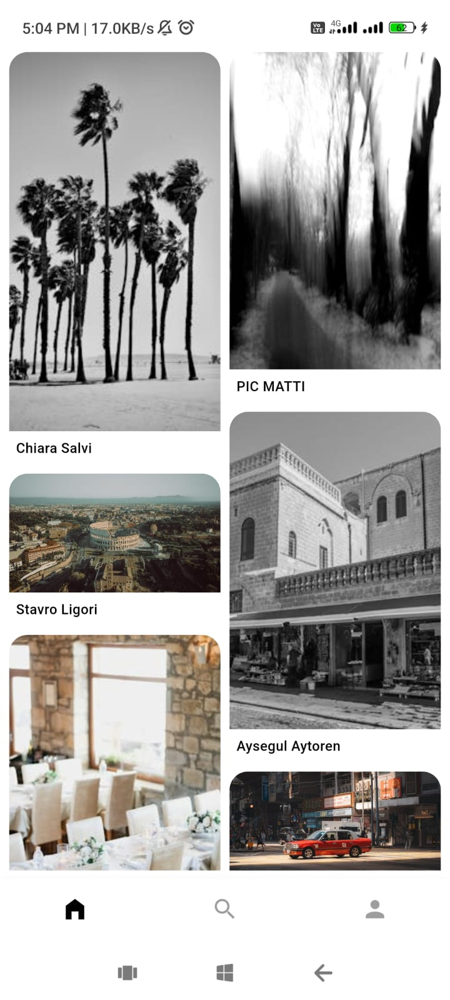
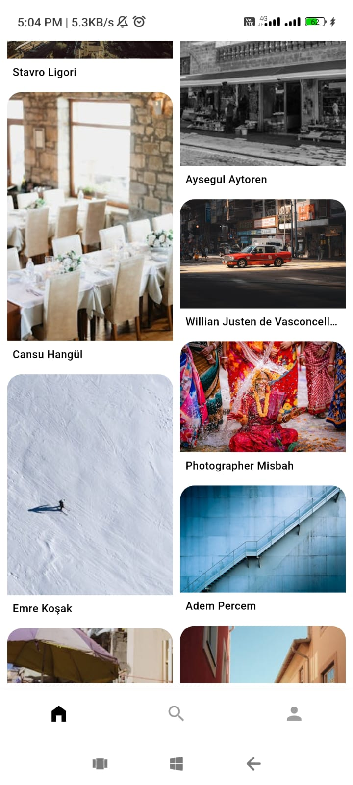
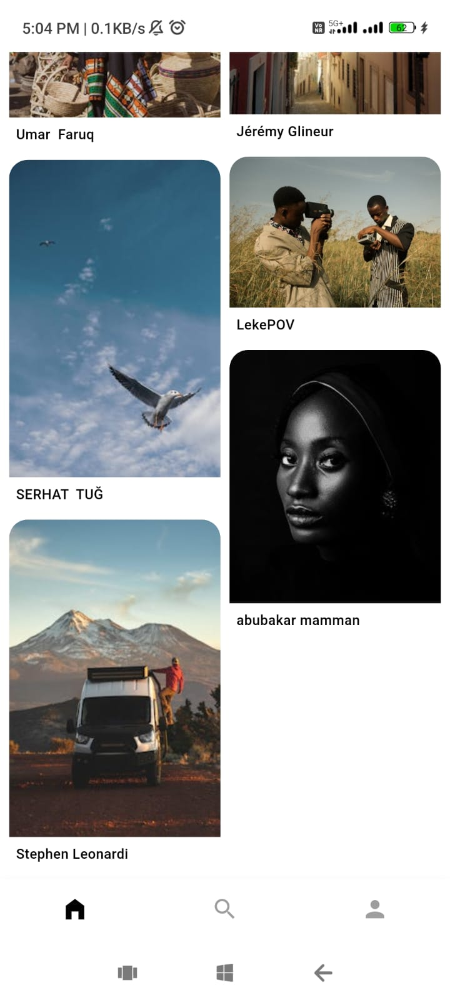
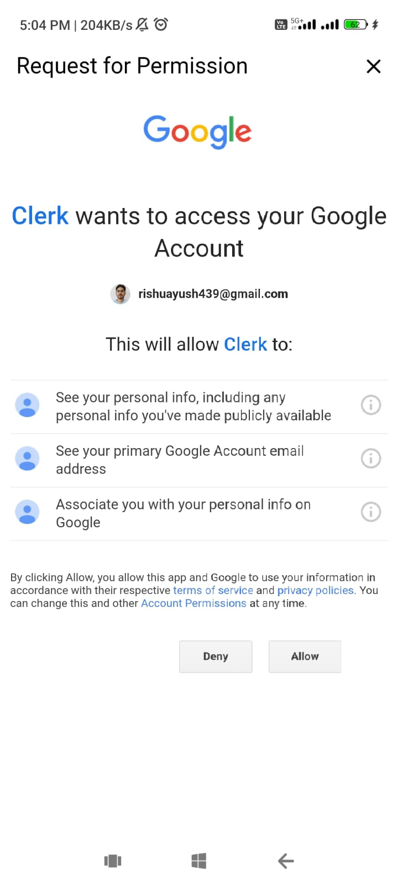
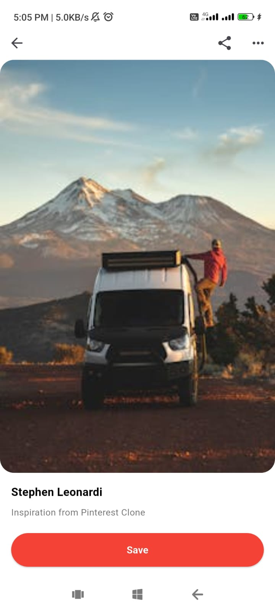
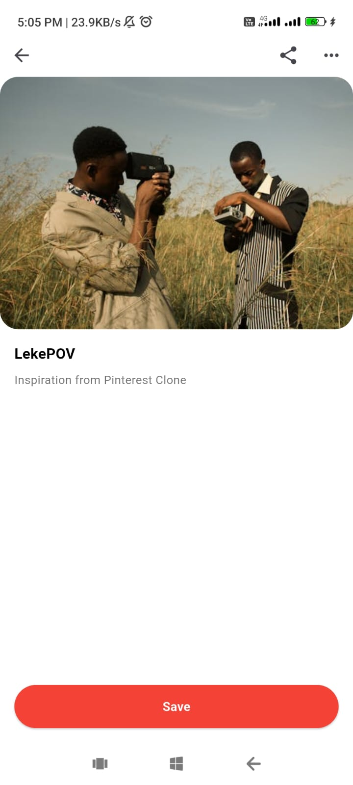

# 📌 Pinterest Clone (Flutter)

A **Pinterest-inspired mobile application** built using **Flutter**, focusing on **UI accuracy, smooth UX, clean architecture, and modern state management**.

This project was developed as a **design + architecture–focused assignment**, emphasizing **attention to detail and real-world best practices** over feature overload.

---

## 🚀 Project Overview

This application replicates the **core Pinterest experience**, including:

- Masonry-style image feed  
- Smooth scrolling and image loading  
- Pin detail view with **Hero animations**  
- Search and profile sections  
- Authentication using **Clerk**  
- **Clean Architecture** with **Riverpod**

### 🎯 Project Goal

Rather than cloning Pinterest feature-by-feature, this project demonstrates:

- UI precision  
- Architectural clarity  
- Performance-conscious development  
- Scalable, production-ready patterns  

---

## 🧠 Design Philosophy

Pinterest’s design is **minimal, calm, and content-first**.  
This project follows the same philosophy:

- No over-designed UI  
- No unnecessary animations  
- Subtle micro-interactions  
- Smooth transitions  
- Clear separation of concerns  

> **Quality over quantity** was the guiding principle.

---

## 🏗️ Tech Stack (As Required)

| Category | Technology |
|--------|-----------|
| Framework | Flutter |
| State Management | flutter_riverpod |
| Navigation | go_router |
| Networking | dio |
| Image Caching | cached_network_image |
| Loading Effects | shimmer |
| Grid Layout | flutter_staggered_grid_view |
| Authentication | clerk_flutter |
| Environment Variables | flutter_dotenv |

✔ All required packages from the assignment have been used.

---

## 🧱 Architecture

The project follows **Clean Architecture**, divided into three layers:

### 1️⃣ Presentation Layer
Responsible for:
- UI widgets  
- Screens (pages)  
- State observation  

**Technologies**
- Flutter Widgets  
- Riverpod Providers & StateNotifiers  

---

### 2️⃣ Domain Layer
Responsible for:
- Business logic  
- Application rules  

**Contains**
- Entities (pure Dart models)  
- Repository contracts  
- Use cases  

🚫 This layer is **completely framework-independent**.

---

### 3️⃣ Data Layer
Responsible for:
- API communication  
- Data transformation  

**Contains**
- API data sources  
- Repository implementations  
- DTOs / Models  

---

## 📂 Folder Structure

```plaintext
lib/
├── core/
│   ├── constants/
│   ├── network/
│   ├── theme/
│   └── widgets/
│
├── features/
│   ├── home/
│   │   ├── data/
│   │   ├── domain/
│   │   └── presentation/
│   │
│   ├── search/
│   ├── profile/
│   ├── pin_detail/
│   └── auth/
│
├── router/
│   └── app_router.dart
│
├── main.dart
└── main_scaffold.dart


This structure ensures:

1:Scalability
2:Testability
3:Easy maintenance


## 🔐 Authentication (Clerk)

Authentication is handled using **Clerk**, a production-ready authentication solution.

### Why Clerk?
- Secure and reliable  
- Industry-grade authentication  
- Eliminates custom authentication boilerplate  
- Allows greater focus on **UI quality and architecture**

### Implementation Details
- App is wrapped with `ClerkAuth`
- Authentication gate protects the main application
- Clerk provides a built-in Sign In UI

> The authentication UI is intentionally **not custom-built**, as Clerk is responsible for handling authentication securely and efficiently.

---

## 🌐 API & Data Handling

### Image Source
- **Pexels API** is used to fetch curated images

### Networking
- `dio` is used for HTTP requests
- Centralized Dio client for consistent configuration

### Caching
- `cached_network_image` ensures:
  - Disk caching
  - Smooth scrolling experience
  - Reduced network usage

---

## 🔑 Environment Variables & Security

To prevent exposing sensitive data:

- API keys are stored in a `.env` file
- `.env` is ignored using `.gitignore`
- `.env.example` is provided for setup guidance

```env
PEXELS_API_KEY=your_api_key_here
CLERK_FRONTEND_API=your_frontend_api_key_here


🚫 **No secrets are committed to GitHub.**

---

## 🔄 State Management (Riverpod)

Riverpod is used across the application to manage state in a **scalable and predictable** manner.

### ✔ Providers
- Used for dependency injection  
- Handles shared and global state  

### ✔ FutureProvider
- Manages asynchronous API calls  
- Used primarily for the image feed  

### ✔ StateNotifier
- Enables explicit state transitions  
- Supports controller-based business logic  

✔ This implementation satisfies the assignment requirements for:
- Providers  
- Notifiers  
- Controllers  

---

## 🧭 Navigation

Navigation is implemented using **go_router**.

### Key Features
- `ShellRoute` for bottom navigation  
- Tab-based navigation preserves scroll position  
- Clean and maintainable route structure  
- Pin detail screen opens independently of tabs  

---

## 🎨 UI & UX Highlights

- Pinterest-style masonry grid layout  
- Hero animation on pin interaction  
- Shimmer placeholders during loading  
- Pull-to-refresh support on feed  
- Haptic feedback for user interactions  
- No overscroll glow  
- Clean, minimal, content-first design  

---

## 📱 App Flow

```plaintext
App Launch
   ↓
Authentication (Clerk)
   ↓
Home Feed (Masonry Grid)
   ↓
Tap on Pin (Hero + Haptic)
   ↓
Pin Detail Screen
   ↓
Home / Search / Profile


📊 Performance Considerations

Cached images reduce network calls

State-preserving navigation prevents rebuilds

Lightweight widgets ensure smooth scrolling

No unnecessary listeners or rebuilds


🧪 Error & Loading States

Shimmer placeholders during loading

Safe error handling for API failures

App never crashes on network issues

⏱️ Estimated Development Time


~5 Days

Day 1: Architecture & setup

Day 2: Home feed & API

Day 3: Pin detail & animations

Day 4: Search, profile, auth

Day 5: Polish, performance, cleanup


## 📸 App Screenshots

### 🏠 Home Screen




### 🔐 Clerk Authentication


### 🖼️ Pin Detail



### 🔍 Search Screen


### 👤 Profile Screen


🧾 Assignment Compliance Summary
Requirement	Status
UI Accuracy	✅
Clean Architecture	✅
Riverpod Usage	✅
Required Packages	✅
Performance	✅
Authentication	✅
Code Quality	✅
🧑‍💻 Author

Ayush Mishra
Flutter & Full-Stack Developer
Focused on building scalable, clean, and user-centric applications.